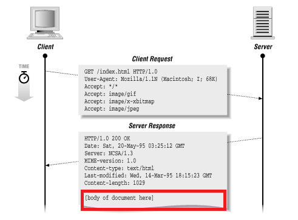

# 1주차 HTTP

## ✏HTTP: 웹 기초

> Http에 대한 개략적인 설명을 합니다.

### 1. http란?

- 웹 브라우저에서 통신을 가능케 하는 프로토콜이다.
- HTTP는 신뢰성 있는 데이터 전송 프로토콜을 사용하고 있기 때문에 데이터가 지구 반대편에서 오더라도 정보 손상들의 걱정을 하지 않아도 됩니다.

### 2. 웹 클라이언트와 서버

- 웹 서버는 보통 HTTP로 통신하기 떄문에 보통 HTTP 서버라고 부른다.
  
- 이때 해당 요청과 응답에는 HTTP 프로토콜이 사용된다.

### 3. 리소스

- 웹 서버는 웹 리소스를 관리하고 제공하는 역할을 한다.
- 이때 웹 리소스는 그림 파일이나 텍스트 파일 같은 파일 시스템 일 수도 있고 HTML 파일 AVI 동영상 파일 등 모든 종류의 파일을 포함한다.
  - 이때 웹 리소스는 꼭 정적 파일일 필요는 없다.
    

#### 3-1. 미디어 타입

- 인터넷은 수많은 데이터 타입을 다룬다. 그렇기 때문에 HTTP는 웹에서 전송되는 객체 각각에 신중하게 MIME 타입이라는 데이터 포맷 라벨을 붙인다.
- MIME 타입을 확인하면 다룰 수 있는 객체인지 MIME 타입을 통해 확인한다.
- `text/html` html로 작성된 텍스트 문서
- `text/plain` plain ASCII 텍스트 문서
- `image/jpeg` jpeg 이미지
- `image/gif` gif 이미지

#### 3-2. URI

- 웹 서버 리소스는 각자의 이름이 있다. 그래서 클라이언트는 관심이 있는 리소스를 URI를 통해서 지목이 가능하다.
  

#### 3-3. URL

- 리소스 식별자의 가장 흔한 형태로 리소스에 대한 구체적 위치를 서술한다.

#### 3-4. URN

- 리소스 위치에 영향을 받지 않는 유일무이한 이름 역할을 한다.
- 리소스가 이름을 변하지 않게 유지하는 동안이라면 여러 종류의 네트워크 접속 프로토콜 접근도 문제 없다.
- 그러나 실험중이고 채택되어 사용하지 않고 있다.

#### 3-5. URL? URN? URI?

- 통상적 관례를 따르자면 URL과 URI는 거의 같은 의미로 사용되고 있다.

### 4. 트랜잭션

- 리소스를 주고 받을 때 HTTP를 사용하는데, 이를 트랜잭션을 사용해 진행한다.
- 아래 그림과 같이 HTTP 메시지라는 것을 이용해서 리소스를 주고 받는 작업이 진행된다.

#### 4-1. HTTP 트랜잭션 요청

- HTTP 요청에 해당 트랜잭션이 사용 됩니다.
- 클라이언트에서 서버 측으로 요청을 보내는 경우가 이에 해당합니다.

#### 4-2. HTTP 트랜잭션 응답

- HTTP 응답에 해당 트랜잭션이 사용 됩니다.
- 서버 측에서 클라이언트 측으로 받은 요청에 대한 응답을 보내는 경우가 이에 해당합니다.

#### 4-3. 메서드

- HTTP는 HTTP 메서드라고 불리는 여러 가지 종류의 요청 명령을 지원한다.
- HTTP 요청 메시지는 반드시 한 개의 메서드를 갖는다.

##### 4-3-1. 메서드 종류

- GET - 서버에서 클라이언트로 지정한 리소스를 보낼 때 사용
- PUT - 클라이언트에서 서버로 보낸 데이터를 지정한 이름의 리소스로 저장할 때 사용
- DELETE - 지정한 리소스를 서버에서 삭제할 때 사용
- POST - 클라이언트 데이터를 서버 게이트웨이 애플리케이션으로 보낼 때 사용
- HEAD - 지정 리소스에 대한 응답에서 HTTP 헤더 부분만 보낼 때 사용

#### 4-4. 상태코드

- 모든 HTTP 응답 메시지는 상태 코드와 함께 반환된다.
- 상태 코드는 클라이언트에게 요청이 성공했는지 아니면 추가 조치가 필요한지를 알려주는 세 자리 숫자이다.

##### 4-4-1. HTTP 상태코드

- 2xx - 성공 응답
- 3xx - 리다이렉트 응답
- 4xx - 클라이언트 에러 응답
- 5xx - 서버 에러 응답

### 5. 메시지

- 요청 메시지는 시작줄, 헤더로 구성되어 있다.
- 응답 메시지는 시작줄, 헤더, 본문으로 구성되어 있다.
- 시작줄: 어떤 요청인지, 어떤 응답인지에 대해서 나타낸다.
- 헤더: 각 헤더 필드는 쉬운 구문분석을 위해 쌍점(;)으로 구분되어 있는 하나의 이름과 하나의 값으로 구성된다. 또한 헤더는 빈줄로 끝난다.
- 본문: 어떤 종류의 데이터든 들어갈 수 있으며 메시지 본문이 필요에 따라 올 수 있다. 요청에도 본문이 사용될 수도 있고 이때 사용한다면 웹 서버로 해당 본문을 이용해 데이터를 실어 보낸다. 응답에서 메시지 본문을 사용하면 클라이언트로 데이터를 반환한다.

### 6. TCP 커넥션

- 메시지가 TCP 커넥션을 통해서 한 곳에서 다른 곳으로 옮겨가는지 살펴보자.

#### 6-1. TCP/IP

- HTTP는 애플리케이션 계층의 프로토콜이다.
  

##### 6-1-1. TCP/IP 특징

- 오류 없는 데이터를 전송한다
- 순서에 맞는 전달을 한다.
- 조각나지 않는 데이터 스트림 즉, 언제든 어떤 크기로든 보낼 수 있다.

> TCP 커넥션이 맺어지면 클라이언트와 서버 컴퓨터 간에 교환되는 메시지가 없어지거나 손상되거나 순서가 뒤바뀌어 수신되는 일은 절대 없다.

### 8. 웹 구성요소

- 프락시: 클라이언트와 서버 사이에 위치한 HTTP 중개자
- 캐시: 많이 찾는 웹페이지를 클라이언트 가까이 보관하는 HTTP 창고
- 게이트웨이: 다른 애플리케이션과 연결된 특별한 웹 서버
- 터널: 단순 HTTP 통신 전달을 위한 특별한 프락시
