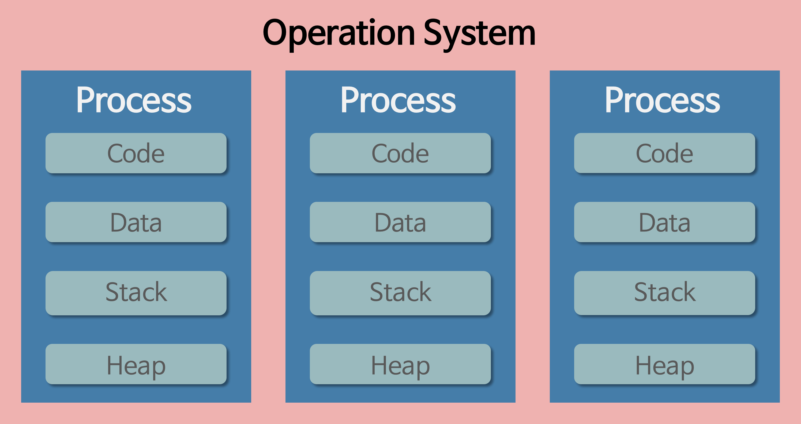
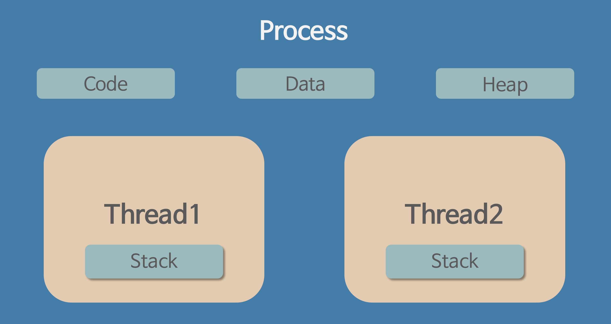
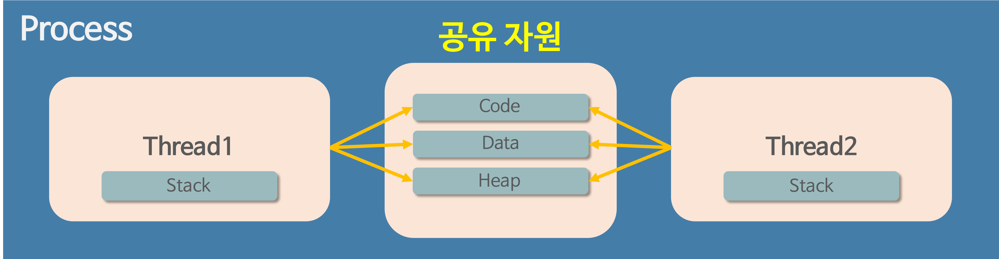

# 스레드와 프로세스

## 1. 프로세스?

- 운영체제로부터 자원을 할당 받은 작업의 단위를 프로세스라 한다.
- "컴퓨터에 연속적으로 실행되고 있는 컴퓨터 프로그램"
- "어떤 작업을 위해 실행할 수 있는 파일"
- 메모리에 올라와서 실행되고 있는 프로그램의 인스턴스를 의미한다.
- 운영체제로부터 시스템 자원을 할당 받는 작업의 단위를 의미한다.

### 1-1. 프로세스 예시

- CPU 시간
- 운영을 위해 필요한 주소 공간
- Code, Data, Stack, Heap 등의 구조로 되어 있는 독립된 메모리 영역

## 2. 스레드?

- 프로세스가 할당 받은 자원을 이용하는 실행 흐름의 단위를 스레드라 한다.
- "프로세스 내에서 실행되는 여러 흐름의 단위"
- 프로세스가 할당 받은 자원을 이용하는 실행 단위

### 2-1. 스레드 특징

- 스레드는 각 stack 영역만 할당 받고 나머지는 공유한다.
- 같은 프로세스 내의 스레드끼리 주소 공간이나 자원원들을 공유하면서 실행한다.

---

# 멀티 프로세스와 멀티 스레드

## 1. 멀티 프로세싱?

### 1-1. 멀티 프로세싱이란?

- 하나의 응용프로그램을 여러 개의 프로세스로 구성해 각 프로세스가 하나의 작업을 처리하도록 하는 것을 의미한다.

### 1-2. 장점

- 여러개의 자식 프로세스 중 하나에 문제가 생기더라도 그 프로세스만 문제가 생기는 것이기 때문에 다른 곳에 영향이 가지 않는다.

### 1-3. 단점

- Context Switching에서의 오버헤드
  - Context Switching 과정에서 캐쉬 메모리 초기화 등 무거운 작업이 진행되고 많은 시간이 소모되는 등의 오버헤드가 발생하게 된다.
  - 프로세스는 각각의 독립된 메모리 영역을 할당받았기 때문에 프로세스 사이에서 공유하는 메모리가 없어, Context Switching가 발생하면 캐쉬에 있는 모든 데이터를 모두 리셋하고 다시 캐쉬 정보를 불러와야 한다.
- 프로세스 사이의 어렵고 복잡한 통신 기법(IPC)
  - 프로세스는 각각의 독립된 메모리 영역을 할당받았기 때문에 하나의 프로그램에 속하는 프로세스들 사이의 변수를 공유할 수 없다.

#### 1-3-1. Context Switching?

- CPU에서 여러 프로세스를 돌아가며 작업을 처리하는데 이 과정을 컨텍스트 스위칭이라 한다.
- 현재 진행하고 있는 Task(Process, Thread)의 상태를 저장하고 다음 진행할 Task의 상태 값을 읽어 적용하는 과정을 말합니다.

## 2. 멀티 스레드

### 2-1. 멀티 스레드란?

멀티 스레딩이란
하나의 응용프로그램을 여러 개의 스레드로 구성하고 각 스레드로 하여금 하나의 작업을 처리하도록 하는 것이다.
윈도우, 리눅스 등 많은 운영체제들이 멀티 프로세싱을 지원하고 있지만 멀티 스레딩을 기본으로 하고 있다.
웹 서버는 대표적인 멀티 스레드 응용 프로그램이다.

### 2-2. 장점

- 시스템 자원 소모 감소 (자원의 효율성 증대)
- 프로세스를 생성하여 자원을 할당하는 시스템 콜이 줄어들어 자원을 효율적으로 관리할 수 있다.
- 시스템 처리량 증가 (처리 비용 감소)
  스레드 간 데이터를 주고 받는 것이 간단해지고 시스템 자원 소모가 줄어들게 된다.
- 스레드 사이의 작업량이 작아 Context Switching이 빠르다.
- 간단한 통신 방법으로 인한 프로그램 응답 시간 단축
- 스레드는 프로세스 내의 Stack 영역을 제외한 모든 메모리를 공유하기 때문에 통신의 부담이 적다.

### 2-3. 단점

- 주의 깊은 설계가 필요하다.
- 디버깅이 까다롭다.
- 단일 프로세스 시스템의 경우 효과를 기대하기 어렵다.
- 다른 프로세스에서 스레드를 제어할 수 없다. (즉, 프로세스 밖에서 스레드 각각을 제어할 수 없다.)
- 멀티 스레드의 경우 자원 공유의 문제가 발생한다. (동기화 문제)
- 하나의 스레드에 문제가 발생하면 전체 프로세스가 영향을 받는다.

## 멀티 프로세스가 아닌 멀티 스레드를 사용하는 이유?

- 자원의 효율성 증대
  멀티 프로세스로 실행되는 작업을 멀티 스레드로 실행할 경우, 프로세스를 생성하여 자원을 할당하는 시스템 콜이 줄어들어 자원을 효율적으로 관리할 수 있다.
  –> 프로세스 간의 Context Switching시 단순히 CPU 레지스터 교체 뿐만 아니라 RAM과 CPU 사이의 캐쉬 메모리에 대한 데이터까지 초기화되므로 오버헤드가 크기 때문
  스레드는 프로세스 내의 메모리를 공유하기 때문에 독립적인 프로세스와 달리 스레드 간 데이터를 주고 받는 것이 간단해지고 시스템 자원 소모가 줄어들게 된다.
- 처리 비용 감소 및 응답 시간 단축
  또한 프로세스 간의 통신(IPC)보다 스레드 간의 통신의 비용이 적으므로 작업들 간의 통신의 부담이 줄어든다.
  –> 스레드는 Stack 영역을 제외한 모든 메모리를 공유하기 때문
  프로세스 간의 전환 속도보다 스레드 간의 전환 속도가 빠르다.
  –> Context Switching시 스레드는 Stack 영역만 처리하기 때문

## 멀티 스레드 주의점

- 동기화 문제
- 스레드 간의 자원 공유는 전역 변수를 이용하기 때문에 함께 사용할 때 충돌이 발생할 수 있다.

---

# 자바 스레드

## 1. 자바에서의 스레드?

- 일반 스레드와 차이가 거의 없고 JVM가 운영체제 역할을 한다.
- 자바에서는 프로세스는 존재하지 않는다.
- 자바에서는 스레드만 존재하며 자바 스레드는 JVM에 이의해서 스케줄되는 실행 단위 코드 블럭이다.
- 자바의 스레드 스케줄링은 JVM에서 이루어진다.
- 아래와 같은 스레드와 관련된 많은 정보들도 JVM이 관리한다.
  - 스레드가 몇 개 존재하는지
  - 스레드로 실행되는 프로그램 코드의 메모리 위치는 어디인지
  - 스레드의 상태는 무엇인지
  - 스레드 우선순위는 얼마인지

## 2. 자바 스레드

- 개발자는 자바 스레드로 작동할 스레드 코드를 작성하고 스레드 코드의 실행을 할수 있도록 JVM에 요청하는 정도의 일만 진행한다.
