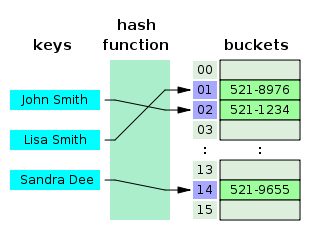
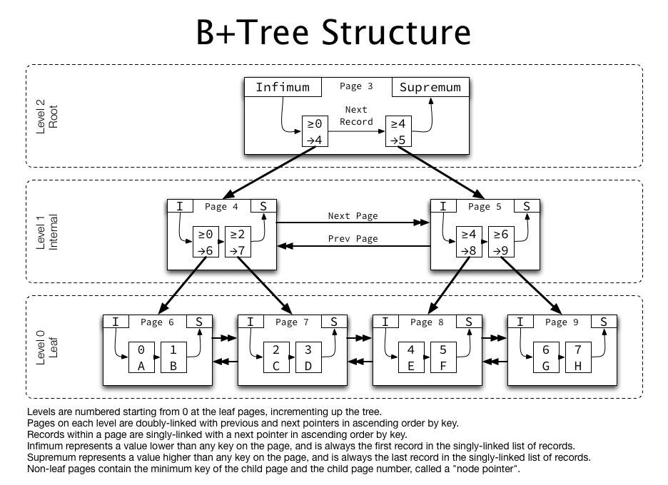

# 인덱스란?

## 인덱스란 무엇일까

### 1. 자료구조

- 데이터베이스 테이블 검색 속도 향상을 위한 자료구조이다.
- 책을 기준으로 생각해보자, 책의 원하는 부분을 직접 다 찾아야 한다면 이는 시간이 너무 오래 걸릴 것이다.
- 그래서 우리는 책의 맨 앞에 또는 뒤에 색인을 추가하는데 데이터베이스의 인덱스가 책의 색인과 같다.
  

### 2. 저장에 추가적으로 생성되는 자료구조 개념

- 테이블 안에 인덱스가 존재하는 것이 아닌 인덱스가 자체적인 저장공간에 생성된다.
- 이때 저장공간이 추가적으로 필요하다는 점이 있지만 그럼에도 빠른 검색을 도모할 수 있기 때문에 인덱스를 사용한다.

### 3. 검색 이외에도 성능 향상을 이끄는 인덱스

- 덱스를 활용하면, 데이터를 조회하는 SELECT 외에도 UPDATE나 DELETE의 성능이 함께 향상된다. 그러한 이유는 해당 연산을 수행하려면 해당 대상을 조회해야만 작업을 할 수 있기 때문이다.
- 인덱스가 없이 검색을 진행하려면 테이블을 전체 검색하는 Full scan을 수행해야하고 처리 속도가 떨어진다. 그러나 인덱스를 사용하면 이럴 일이 없어서 처리 속도가 높아진다.

## 인덱스 관리

### 1. 인덱스 추가 삭제 수정

- 인덱스는 최신 정렬 상태로 유지해야 원하는 빠른 값을 탐색할 수 있기 때문에 데이터 추가 삭제 수정 작업이 있을 때 다음과 같은 연산을 추가적으로 진행해주어야 하고 그에 따른 오버헤드가 발생하게 된다.

## 인덱스 장단점

### 1. 장점

- 테이블을 조회하는 속도와 그에 따른 성능을 향상시킬 수 있다.
- 전반적인 시스템의 부하를 줄일 수 있다.

### 2. 단점

- 인덱스를 관리하기 위해 DB의 약 10%에 해당하는 저장공간이 필요하다.
- 인덱스를 관리하기 위해 추가 작업이 필요하다.
- 인덱스를 잘못 사용할 경우 오히려 성능이 저하되는 역효과가 발생할 수 있다.

### 3. 빈번한 인덱스 수정, 삭제, 추가

- 빈번하게 인덱스 데이터가 변경되거나 추가되거나 삭제되는 경우라면 인덱스 크기가 너무 커지게 된다. 또한 수정과 삭제 시 해당 데이터가 삭제되는 개념이 아니고 사용하지 않는 데이터로 처리가 되기 때문에 더 많은 데이터가 저장됨을 알수 있다.

## 인덱스(index)를 사용하면 좋은 경우

- 규모가 작지 않은 테이블
- INSERT, UPDATE, DELETE가 자주 발생하지 않는 컬럼
- JOIN이나 WHERE 또는 ORDER BY에 자주 사용되는 컬럼
- 데이터의 중복도가 낮은 컬럼

# 인덱스 자료구조

## 해시 테이블

### 1. 빠른 검색에 사용하는 해시테이블

- key, value로 데이터를 저장하는 자료구조로 빠른 데이터 검색에 사용한다.
- key 값을 이용해 고유한 인덱스를 생성하고 그 인덱스에 저장된 값을 꺼내온다.
- 그러나 부등호 연산이 자주 사용되는 데이터베이스 검색은 이에 적합하지 않는다.
- 해시 테이블의 경우엔 정확한 위치를 찾는 경우엔 매우 빠르지만 정렬되어 저장된 데이터가 아니기 때문에 부등호를 사용해서 범위를 가져와야 하는 경우엔 적합하지 않기 때문이다.
- 그래서 위와 같은 이유 때문에 인덱스의 자료구조는 B+Tree 구조를 일반적으로 사용한다.

## B+Tree

- 자식 노드가 2개 이상인 B-Tree를 개선시킨 자료구조이다.
- 리프 노드만 인덱스와 함께 데이터를 가지고 있고, 나머지 노드들은 데이터를 위안 인덱스만을 갖는다.
- 리프 노드들은 LinkedList로 연결되어 있다.
- 데이터 노드 크기는 인덱스 노드와 크기가 같지 않아도 된다.
- BTree의 리프노드들을 LinkedList로 연결하여 순차검색을 용이하게 하는 등 BTree를 인덱스에 맞게 최적화 했다.
- 해시에 비해서 시간 복잡도가 더 크지만 해시 테이블보다 인덱싱에 더 적합한 자료구조 이기 때문에 대부분의 인덱스에선 B+Tree 구조를 사용한다.
